# Compose Playground

<strong>About</strong>

Medium profile: https://medium.com/@yuriyskul

This repository is a collection of non-trivial Jetpack Compose UI/graphics experiments.

Each feature is centered around a specific Compose problem and an implementation built to solve or explore it.

<strong>Scope</strong>

This project is intentionally focused on the UI layer only.

It does not try to demonstrate production architecture, modularization, domain/data layers, or a complete app structure. The main focus is stateless or near-stateless UI implementation and rendering techniques.

It also does not follow one custom design system or one visual specification. That is intentional: this repository collects very different Jetpack Compose problems, and each feature uses the visual approach that best exposes the idea behind the implementation.

<strong>Topics</strong>

The project currently explores topics such as:

- AGSL shaders and `RenderEffect`
- gooey / metaball interactions
- transparent metaball outlines
- custom blur and radial blur
- vector drawable shadows
- bottom-edge-only shadows
- sticky header state detection
- parallax and animated controls
- custom Canvas-based rendering

<strong>Articles</strong>

All features are described in my Medium articles:

- Medium profile: https://medium.com/@yuriyskul

<strong>Tech</strong>

- Kotlin
- Jetpack Compose
- Compose customization
- Animation
- AGSL
- Canvas drawing
- Android graphics / blur / shader experiments

**Feature Catalog**

### Sensor Rotation

A Jetpack Compose experiment that explores sensor-driven rotation, custom shape morphing, and text layout inside rotating non-rectangular containers.

Published: not published

Code: [feature/sensorRotation](app/src/main/java/com/skul/yuriy/composeplayground/feature/sensorRotation)

---

### Flow Text

A text-flow experiment focused on overflow behavior and non-standard text layout presentation in Compose.

Published: not published

---

### Rect Snake Border

A Jetpack Compose animated rectangle border with a snake-style highlight and support for different corner radii.

Published in:  [ProAndroidDev](https://proandroiddev.com/jetpack-compose-animated-snake-border-for-rectangle-shapes-31de5e9ef713)

Code: [feature/animatedRectButton](app/src/main/java/com/skul/yuriy/composeplayground/feature/animatedRectButton)

---

### Animated Glowing Border

A Jetpack Compose experiment that explores multiple ways to draw glowing rectangle borders and compares them with HWUI profiling.

0. PNG borders with crossfade on tap
1. Multi-layering in Canvas with different sizes
2. Paint with `BlurMaskFilter`
3. Blur using `RenderEffect`
4. Applying `Paint.setShadowLayer()` multiple times
5. Circular gradient for rounded corners + linear gradients for the four sides
6. Custom AGSL applied via `RuntimeEffect` or as a Canvas shader
7. Advanced AGSL originally prototyped by me in GLSL on [ShaderToy](https://www.shadertoy.com/view/fcfGzH)

  
  
  
  

  
  
  
  

Published in:  [ProAndroidDev](https://proandroiddev.com/how-many-ways-do-you-know-to-draw-a-glowing-border-in-jetpack-compose-57980d049562)

Code: [feature/animatedBorderRect](app/src/main/java/com/skul/yuriy/composeplayground/feature/animatedBorderRect)

---

### PDE-Based Wave Simulation in Jetpack Compose: Canvas vs AGSL

A Jetpack Compose experiment that compares three ways to build a PDE-based wave effect and highlights where classic Canvas rendering can outperform per-pixel AGSL for simple 1D simulations.

- AGSL `RenderEffect`
- AGSL shader via `Paint`
- A classic Canvas approach

For simple 1D simulations, the classic Android `Path` API with cubic interpolation can outperform per-pixel AGSL rendering.

Published in:  [ProAndroidDev](https://proandroiddev.com/pde-based-wave-simulation-in-jetpack-compose-canvas-vs-agsl-58d52a88f22f)

Code: [feature/liquidBar](app/src/main/java/com/skul/yuriy/composeplayground/feature/liquidBar)

---

### Jetpack Compose Metaball Edge Effect - Final Part

A controlled way to build metaball interaction between scrolling content and screen edges. The core idea is a localized custom blur applied only near the edges, with a dynamically increasing radius as elements approach the boundary. This avoids the typical issue where everything turns into a blob and keeps the effect visually clean and controlled.

  
  

Gooey edge effect + Melt effect

Vertical scroll code: [feature/metaballEdgesAdvanced](app/src/main/java/com/skul/yuriy/composeplayground/feature/metaballEdgesAdvanced)

Horizontal metaball edges

Horizontal scroll code: [feature/metaballEdgeHorizontalScroll](app/src/main/java/com/skul/yuriy/composeplayground/feature/metaballEdgeHorizontalScroll)

Published in:  [ProAndroidDev](https://proandroiddev.com/jetpack-compose-metaball-edge-effect-final-part-ac8a4cc7a425)

---

### AGSL Alpha Blur with Local Regions and Dynamic Radius (Linear and Gaussian, 17/61/101 taps)

A Jetpack Compose experiment focused on dynamic and local alpha blur on Android. Native blur is static and cannot be applied selectively to a local region inside a composable, so this AGSL-based Gaussian alpha blur explores 17-, 61-, and 101-tap kernel quality, selective blur applied only to chosen composable areas, and blur strength that changes with distance.

  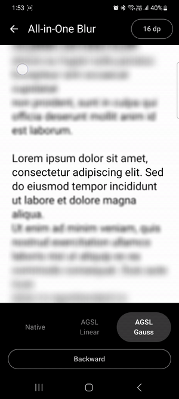
  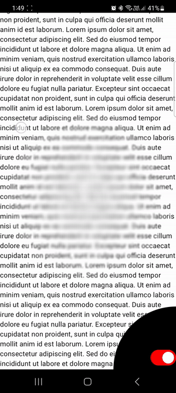

The goal here is applying blur locally, where blur strength gradually changes based on the distance from the center.

Published in: [Medium](https://medium.com/@yuriyskul/agsl-alpha-blur-with-local-regions-and-dynamic-radius-linear-and-gaussian-17-61-101-taps-3a36198c9567)

Code: [feature/customAlphaBlur](app/src/main/java/com/skul/yuriy/composeplayground/feature/customAlphaBlur), [feature/customAlphaBlurRadial](app/src/main/java/com/skul/yuriy/composeplayground/feature/customAlphaBlurRadial)

---

### Text Metaball Scrolling Edges: local overlay with regular Compose `Modifier.blur()`

This approach uses the standard `blur()` API. To avoid blurring the whole screen, the text is additionally covered with top and bottom overlay bands that duplicate the text and its position in blurred form. The scroll offset is synchronized through the scroll state of the main full-screen text. This solution is more of a foreground workaround that demonstrates why a local dynamic blur implementation was needed.

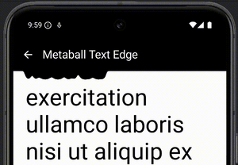

Published in: [Medium](https://medium.com/@yuriyskul/text-metaball-scrolling-edges-local-overlay-with-regular-compose-modifier-blur-23b835242815)

Code: [feature/metaballEdgesRegular](app/src/main/java/com/skul/yuriy/composeplayground/feature/metaballEdgesRegular)

---

### AGSL Text Metaball Scrolling Edges And Text

This feature covers two related ideas at once: the basic metaball concept between the screen edge and a dragging object (circle shape), and the core text metaball behavior, where blur causes the text to merge and interact with itself.

  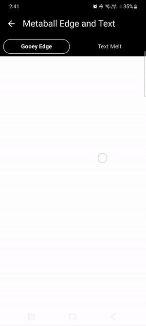
  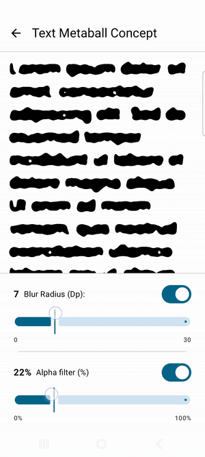

  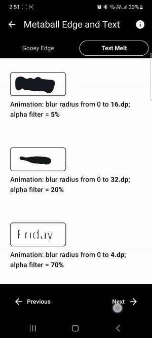

Published in: [Medium](https://medium.com/@yuriyskul/agsl-text-metaball-scrolling-edges-getting-started-696d59418127)

Code: [feature/metaballEdgesAndText](app/src/main/java/com/skul/yuriy/composeplayground/feature/metaballEdgesAndText)

---

### Compose AGSL Shader: Gooey Outline Metaball Effect with Transparent Background

This feature explores a transparent-background gooey outline metaball effect in Compose using AGSL and per-element blur. Marker color detection, alpha filtering, and brightness-based transparency are used to preserve the outline and support smooth icon disappearance and reappearance during metaball interaction.

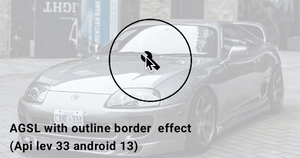

Published in: [Medium](https://medium.com/@yuriyskul/compose-agsl-shader-gooey-outline-metaball-effect-with-transparent-background-cb8b0e72286c)

Code: [ExampleRuntimeRenderEffectOutline.kt](app/src/main/java/com/skul/yuriy/composeplayground/feature/gooey/blurConcept/ExampleRuntimeRenderEffectOutline.kt), [OutlineAgslShader.kt](app/src/main/java/com/skul/yuriy/composeplayground/feature/gooey/blurConcept/util/shader/OutlineAgslShader.kt)

---

### Jetpack Compose: Gooey (Metaball) Interaction Using AGSL Shader and Blur - Fixing Coloring Issues

A small follow-up to the previous gooey AGSL work focused on fixing coloring issues. The key takeaways are that AGSL should always be clipped to the intended bounds so it does not affect content outside the target area, and the shader should explicitly return the target color for the semi-transparent metaball region instead of relying on the original blurred input color.

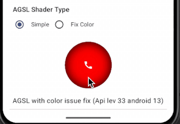

Published in: [Medium](https://medium.com/@yuriyskul/jetpack-compose-gooey-metaball-interaction-using-agsl-shader-and-blur-fixing-coloring-issues-c70affdcde0f)

Code: [ExampleRuntimeRenderEffectColorFix.kt](app/src/main/java/com/skul/yuriy/composeplayground/feature/gooey/blurConcept/ExampleRuntimeRenderEffectColorFix.kt)

---

### Compose Gooey (Metaball) Button Effect: Fixing Blur Mask Issues on Pre-Android 10 Devices

A legacy-device workaround for gooey metaball buttons on pre-Android 10. `BlurMaskFilter` is replaced with a circular gradient, while the metaball filtering still relies on the legacy Android color-filter pipeline.

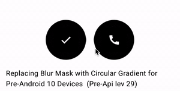

Published in: [Medium](https://medium.com/@yuriyskul/compose-gooey-metaball-button-effect-fixing-blur-mask-issues-on-pre-android-10-devices-with-d8f3fadc2680)

Code: [ExampleLegacySolution.kt](app/src/main/java/com/skul/yuriy/composeplayground/feature/gooey/blurConcept/ExampleLegacySolution.kt)

---

### Gooey (Metaball) Effects on Android with Jetpack Compose: Blurring and Alpha Filtering Concepts Across All API Levels

A cross-API overview of gooey (metaball) effects in Jetpack Compose. All versions are based on the same idea: blur first, then filter by alpha. The API 33+ version uses AGSL Runtime Shader, the API 31+ version uses RenderEffect for blur and color filtering, and the pre-31 version falls back to Paint with BlurMaskFilter.

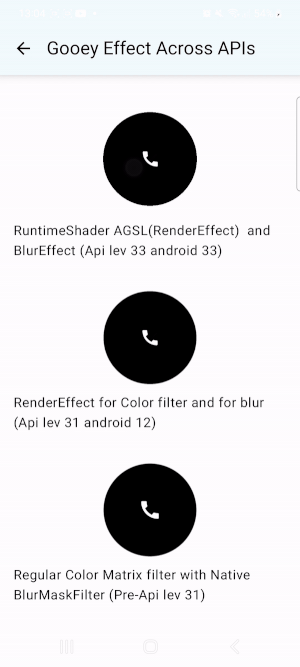

Published in: [Medium](https://medium.com/@yuriyskul/gooey-metaball-effects-on-android-with-jetpack-compose-blurring-and-alpha-filtering-concepts-63f1cf879257)

Code: [feature/gooey/blurConcept](app/src/main/java/com/skul/yuriy/composeplayground/feature/gooey/blurConcept)

---

### Animated Glowing Circular Button

A complete Jetpack Compose implementation that combines glow, blur, and gradient-shadow techniques into an animated circular button. The rotating circular border is driven by an animated angle, the press state is rendered with a clipped halo gradient, and the inner drop shadow is implemented as a second blurred icon layer with a dynamic offset derived from the current rotation angle.

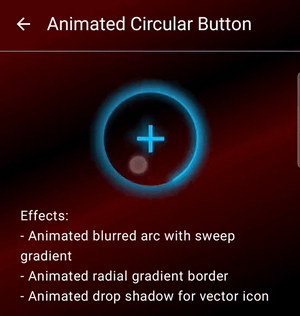

Published in: [Medium](https://medium.com/@yuriyskul/making-an-animated-glowing-circular-button-with-blur-and-gradient-shadows-in-jetpack-compose-72ffe9a3169d)

Code: [feature/animatedCircularButton](app/src/main/java/com/skul/yuriy/composeplayground/feature/animatedCircularButton)

---

### Jetpack Compose: Creating Direct and Spread Light Shadows for Vector Drawables (API 12+)

A Jetpack Compose implementation for direct and spread vector shadows built from a second duplicated icon layer. The shadow is created by blurring that extra layer, then applying an offset for direct drop shadow, or adding scale for spread shadow around the original icon.

  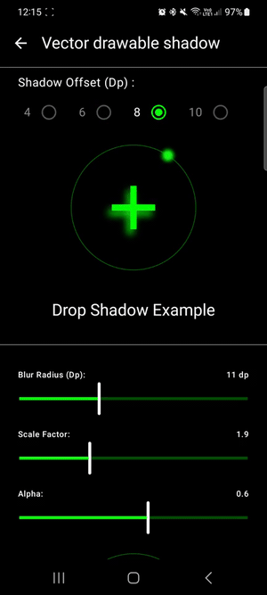
  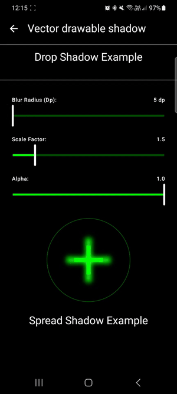

Left: Direct drop shadow. Right: Spread shadow.

Published in: [Medium](https://medium.com/@yuriyskul/jetpack-compose-creating-direct-and-spread-light-shadows-for-vector-drawables-api-12-230362982a0f)

Code: [DropShadowSection.kt](app/src/main/java/com/skul/yuriy/composeplayground/feature/vectorIconShadow/DropShadowSection.kt), [SpreadHaloShadowSection.kt](app/src/main/java/com/skul/yuriy/composeplayground/feature/vectorIconShadow/SpreadHaloShadowSection.kt)

---

### Animating Circular Shadow Borders in Jetpack Compose: Rotating Arcs with Blur and Gradient Effects

A fully customized Jetpack Compose rotating circular border built from a sweep-gradient arc body and a blurred glowing arc layer. The border rotation is animated independently from the inner content, while arc width, blur radius, padding behavior, and glow styling remain fully configurable.

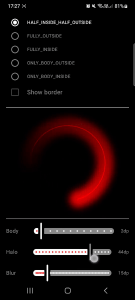

Published in: [Medium](https://medium.com/@yuriyskul/animating-circular-shadow-borders-in-jetpack-compose-rotating-arcs-with-blur-and-gradient-effects-4e4288daf7bf)

Code: [feature/rotationArk](app/src/main/java/com/skul/yuriy/composeplayground/feature/rotationArk)
