# Compose Playground

<strong>About</strong>

Medium profile: https://medium.com/@yuriyskul

This repository is a collection of non-trivial Jetpack Compose UI/graphics experiments.

Each feature is centered around a specific Compose problem and an implementation built to solve or explore it.

<strong>Scope</strong>

This project is intentionally focused on the UI layer only.

It does not try to demonstrate production architecture, modularization, domain/data layers, or a complete app structure. The main focus is stateless or near-stateless UI implementation and rendering techniques.

It also does not follow one custom design system or one visual specification. That is intentional: this repository collects very different Jetpack Compose problems, and each feature uses the visual approach that best exposes the idea behind the implementation.

<strong>Topics</strong>

The project currently explores topics such as:

- AGSL shaders and `RenderEffect`
- gooey / metaball interactions
- transparent metaball outlines
- custom blur and radial blur
- vector drawable shadows
- bottom-edge-only shadows
- sticky header state detection
- parallax and animated controls
- custom Canvas-based rendering

<strong>Articles</strong>

All features are described in my Medium articles:

- Medium profile: https://medium.com/@yuriyskul

<strong>Tech</strong>

- Kotlin
- Jetpack Compose
- Compose customization
- Animation
- AGSL
- Canvas drawing
- Android graphics / blur / shader experiments

**Feature Catalog**

## Sensor Rotation

A Jetpack Compose experiment that explores sensor-driven rotation, custom shape morphing, and text layout inside rotating non-rectangular containers.

Published: not published

Code: [feature/sensorRotation](app/src/main/java/com/skul/yuriy/composeplayground/feature/sensorRotation)

## Flow Text

A text-flow experiment focused on overflow behavior and non-standard text layout presentation in Compose.

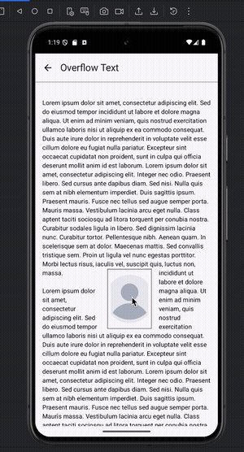

Published: not published

## Rect Snake Border

A Jetpack Compose animated rectangle border with a snake-style highlight and support for different corner radii.

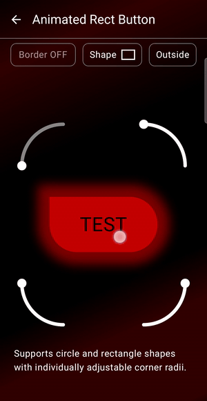

Published in: 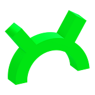 [ProAndroidDev](https://proandroiddev.com/jetpack-compose-animated-snake-border-for-rectangle-shapes-31de5e9ef713)

Code: [feature/animatedRectButton](app/src/main/java/com/skul/yuriy/composeplayground/feature/animatedRectButton)

## Glowing Border Rect

A Jetpack Compose experiment that explores multiple ways to draw glowing rectangle borders and compares them with HWUI profiling.

0. PNG borders with crossfade on tap
1. Multi-layering in Canvas with different sizes
2. Paint with `BlurMaskFilter`
3. Blur using `RenderEffect`
4. Applying `Paint.setShadowLayer()` multiple times
5. Circular gradient for rounded corners + linear gradients for the four sides
6. Custom AGSL applied via `RuntimeEffect` or as a Canvas shader
7. Advanced AGSL originally prototyped by me in GLSL on [ShaderToy](https://www.shadertoy.com/view/fcfGzH)

  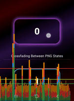
  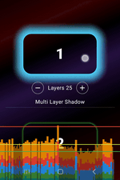
  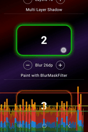
  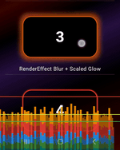

  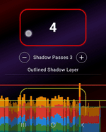
  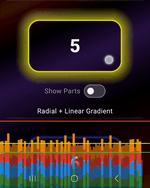
  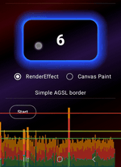
  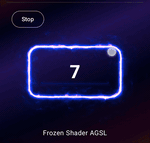

Published in:  [ProAndroidDev](https://proandroiddev.com/how-many-ways-do-you-know-to-draw-a-glowing-border-in-jetpack-compose-57980d049562)

Code: [feature/animatedBorderRect](app/src/main/java/com/skul/yuriy/composeplayground/feature/animatedBorderRect)

## PDE-Based Wave Simulation in Jetpack Compose: Canvas vs AGSL

A Jetpack Compose experiment that compares three ways to build a PDE-based wave effect and highlights where classic Canvas rendering can outperform per-pixel AGSL for simple 1D simulations.

- AGSL `RenderEffect`
- AGSL shader via `Paint`
- A classic Canvas approach

For simple 1D simulations, the classic Android `Path` API with cubic interpolation can outperform per-pixel AGSL rendering.

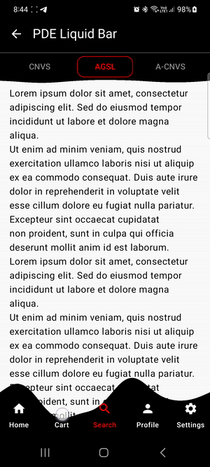

Published in:  [ProAndroidDev](https://proandroiddev.com/pde-based-wave-simulation-in-jetpack-compose-canvas-vs-agsl-58d52a88f22f)

Code: [feature/liquidBar](app/src/main/java/com/skul/yuriy/composeplayground/feature/liquidBar)

## Jetpack Compose Metaball Edge Effect - Final Part

A controlled way to build metaball interaction between scrolling content and screen edges. The core idea is a localized custom blur applied only near the edges, with a dynamically increasing radius as elements approach the boundary. This avoids the typical issue where everything turns into a blob and keeps the effect visually clean and controlled.

  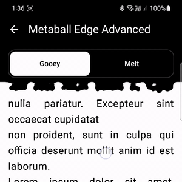
  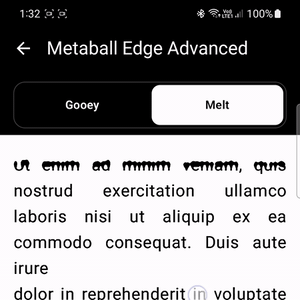

Gooey edge effect + Melt effect

Vertical scroll code: [feature/metaballEdgesAdvanced](app/src/main/java/com/skul/yuriy/composeplayground/feature/metaballEdgesAdvanced)

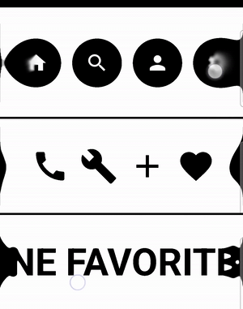

Horizontal metaball edges

Horizontal scroll code: [feature/metaballEdgeHorizontalScroll](app/src/main/java/com/skul/yuriy/composeplayground/feature/metaballEdgeHorizontalScroll)

Published in:  [ProAndroidDev](https://proandroiddev.com/jetpack-compose-metaball-edge-effect-final-part-ac8a4cc7a425)
